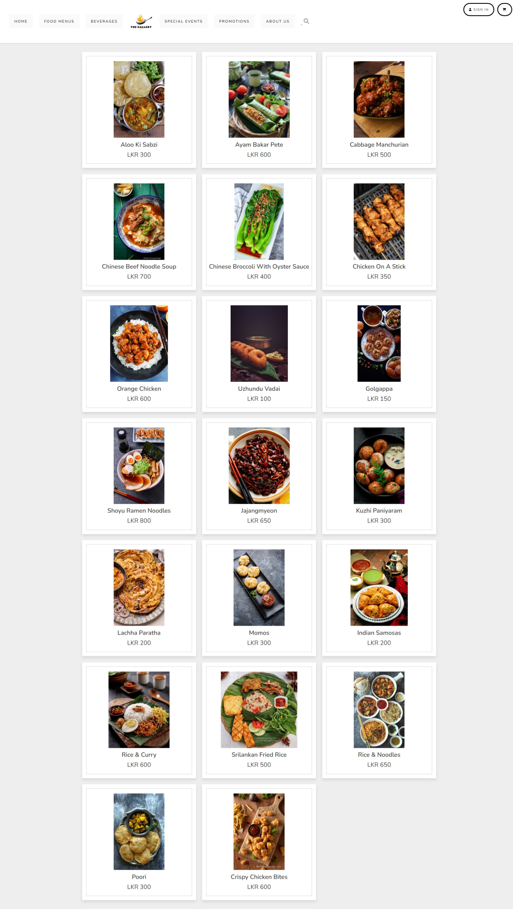
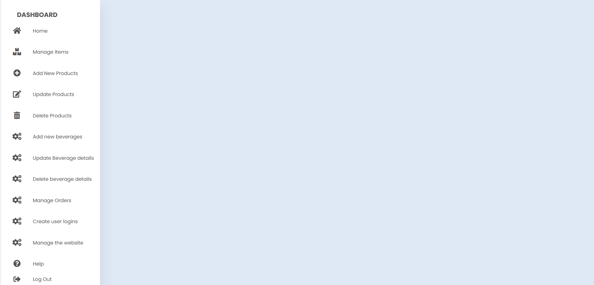

# The Gallery Café Website

The Gallery Café Website is a dynamic, database-driven web application developed to enhance the customer experience of The Gallery Café. It allows users to explore the restaurant's offerings, place food and beverage orders, make table reservations, and stay updated on special events and promotions.

## 🔧 Tech Stack

- **Frontend:** HTML, CSS, JavaScript  
- **Backend:** PHP  
- **Database:** MySQL  
- **Development Environment:** XAMPP (Apache, MySQL, PHP)

## 🌟 Features

- 🧾 **Menu Display**: View food and beverage items with images, descriptions, and prices  
- 🛒 **Order Management**: Add items to cart and proceed to checkout  
- 🪑 **Table Reservation**: Book tables in advance with date and time selection  
- 🔐 **User Authentication**: Sign up, log in, and manage orders  
- 🧑‍💻 **Admin Panel**: Admins can manage menu items, user data, and orders  
- 📱 **Responsive Design**: Optimized for both desktop and mobile viewing  

## 📁 Project Structure

/Thegallerycafe │ ├── Homepage/ # Frontend pages ├── php/ # PHP backend logic ├── images/ # Images used on the website ├── css/ # Stylesheets ├── js/ # JavaScript files ├── database.sql # MySQL database structure └── README.md # Project documentation

## 🚀 How to Run

1. Clone the repo:
   ```bash
   git clone https://github.com/naksherth/Thegallerycafe.git

   ## 🖼️ Screenshots

### Homepage


### Menu & Order Page


### Table Reservation


### Login / Signup Page


### Admin Panel



